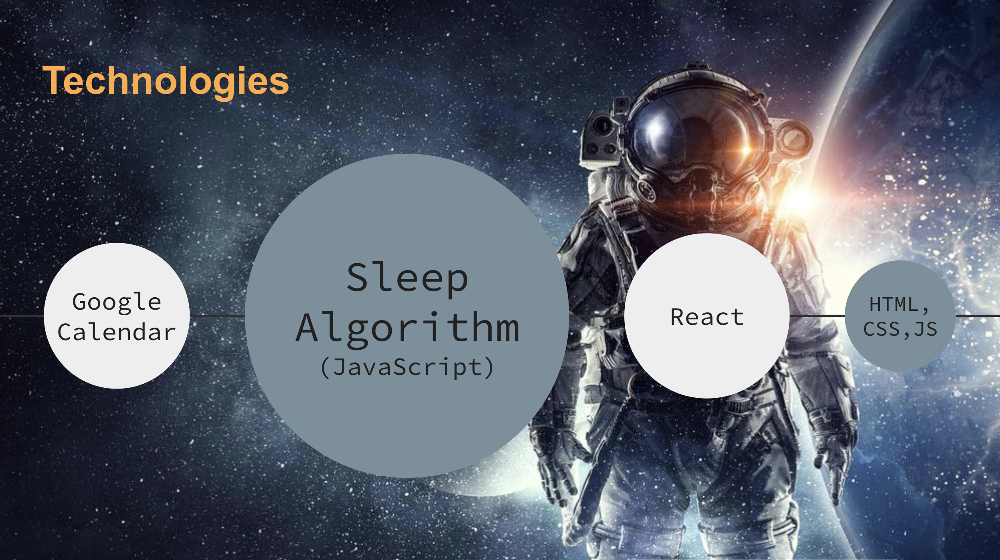

# 🚀💤 About the Power Sleep App 🚀💤

Sleep Shift Scheduling Tool developed for the Space Apps Challenge 2020 from NASA.

## 🌌 Prompt:

"Sleep loss and fatigue may lead to reduced performance and an increased risk to safety during many activities, including spaceflight. Your challenge is to develop an operational sleep shift scheduling tool that provides autonomous customization of a schedule for sleep, exercise, and nutrition to manage fatigue."

## 🌠 Summary:

Power Sleep is a web app fully integrated with Google Calendar that utilizes our algorithm to provide options to the user for sleep sessions. Our algorithm uses scheduled events and sleep optimizations to provide an output of suggested sleep windows to the user. Our app is flexible enough that any person could use it, not just in space!


## 👩‍🚀 How We Addressed This Challenge:

We used the sample calendar provided to create basic testing scenarios for a given day, then built an algorithm that reads the data from the calendar, takes in all scheduled events and then makes recommendations for when to sleep. The user has ultimate control and can choose whether or not to add the recommended sleep window to their calendar. One day, we would like to add more complexity to our algorithm to give the user several options to choose from, including contingency plans when emergencies arise.


## 👽 Tech Stack:

The main technologies we used for this project are listed in the image below:



## 👨‍🚀 How We Developed This Project:

We chose this project because we felt like it was something that relates to our own daily lives, and could be potentially for everyone! We wanted to utilize tools that were available to any average user, which is why we chose to take advantage of the Google services. By using Google Calendar, the user is easily able to integrate their own schedule into the app without any additional set-up.

By adding other users calendars (such as Mission Control or a fellow astronaut!) the user can see and schedule around all events.

Our app is deployed publicly here: https://power-sleep.herokuapp.com/

We used Google API's to access and edit the calendar, and then developed our app using JavaScript and React. We struggled quite a bit initially with the APIs considering that our mock site was not a "verified" site with Google, but we created a SSL / tunnel work around that allowed us to perform algorithm testing locally, while embedding the mock calendar into the deployed publicly available site for presentation. In the future, we would be able to skip the local aspect once the site was verified by Google and the scope of the APIs became fully functional.

## 🌗 Project Presentation

[Link](https://docs.google.com/presentation/d/1uroPhgEiH8KI_o9I2uTmljCkKpCAzzQt8RNCXPJoNEo/edit?usp=sharing)

## 📡 Data & Resources

https://www.nasa.gov/mission_pages/station/research/astronauts_improve_sleep

## 📊 How We Used Space Agency Data in This Project:

We used the sample shift calendars to influence how we designed the app. Given that the access to the other data was limited, we felt that this was the best usage of our time with this particular project and still enormously effective in getting to our goal. We also used various resources posted on the chat boards to learn about optimized sleep.

## 🗂️ Tags:

#Javascript #webapp #GoogleOauth #Scheduler #GoogleCalendar #algorithm #womenInPower #femaleSoftwareEngineers

# 🧑🏻‍🏫 How to use this repo

```shell
git clone https://github.com/WomenInPower/powerSleep.git
npm install
npm run start
```

If you just want to see the deployed website, you can also just click this link: https://power-sleep.herokuapp.com

# 👩🏻‍💻 App Created by:

| Engineer         | LinkedIn Profile                                 | GitHub Profile                  |
| ---------------- | ------------------------------------------------ | ------------------------------- |
| ☀️ Cecilia Chung | https://linkedin.com//in/cecilia-yu-chung-chang/ | https://github.com/ceciliachung |
| ☀️ Lu Wang       | https://linkedin.com//in/loowang/                | https://github.com/LuWang1983   |
| ☀️ Kali          | https://linkedin.com//in/kali-nfn/               | https://github.com/slowgen      |
